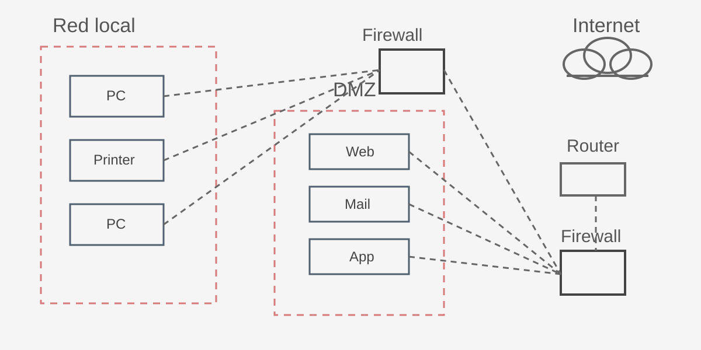

# Seccion 5

## Contenido de la seccion
- [**Video 24:** Implantar la seguridad para protegernos de los ataques](#video-24)
- [**Video 25:** Practicamos con el firewall Portmaster](#video-25)
- [**Video 26:** Seguridad en la nube](#video-26)
- [**Video 27:** Seguridad en dispositivos IoT](#video-27)
- [**Video 28:** Tipos de controles de seguridad](#video-28)

## Implantar la seguridad para protegernos de los ataques

### Resumen breve
En seguridad de sistemas no existe una única defensa perfecta. Se aplican varias capas (red, aplicaciones, endpoints y monitoreo) para reducir riesgos y detectar ataques a tiempo.

## Imagen de referencia de la arquitectura

### ¿Cómo entender esta imagen paso a paso?
1. **Identifica las zonas**:
   - A la izquierda está la **Red local** (equipos internos de la empresa).
   - En el centro está la **DMZ** (servidores expuestos como web/correo/app).
   - A la derecha está **Internet**.
2. **Observa los firewalls**:
   - El primer firewall separa red interna y zonas intermedias.
   - El segundo firewall protege la salida/entrada hacia Internet.
3. **Sigue el recorrido del tráfico**:
   - Un usuario de Internet no debería llegar directo a la red local.
   - Primero pasa por controles (firewalls/router) y, si aplica, llega a servicios en DMZ.
4. **Idea clave de seguridad**:
   - La DMZ actúa como “zona colchón”. Si comprometen un servidor público, aún hay barreras para llegar a la red interna.

**Ejemplo muy sencillo:**
- Tu empresa publica una web en DMZ.
- Un atacante explota la web.
- Gracias a firewalls + segmentación, el atacante no puede conectarse directamente al servidor de nómina que está en la red local.

## Conceptos clave (explicación sencilla)

### 1) Zona Desmilitarizada (DMZ)
La **DMZ** es una red intermedia entre Internet y la red interna de la empresa.
- Ahí se colocan servicios expuestos (web, correo, DNS).
- Si un atacante compromete un servidor en la DMZ, aún no entra directo a la red interna.

**Ejemplo simple:**
Una tienda online publica su servidor web en la DMZ. La base de datos de clientes queda en la red interna. Si atacan la web, no deberían llegar fácilmente a los datos internos.

### 2) Firewalls
Un **firewall** filtra tráfico según reglas (IP, puerto, protocolo, dirección).
- Decide qué conexiones se permiten y cuáles se bloquean.

**Ejemplo simple:**
Permitir solo `HTTPS (443)` hacia el servidor web y bloquear puertos innecesarios como `23 (Telnet)`.

### 3) WAF (Web Application Firewall)
El **WAF** protege aplicaciones web analizando peticiones HTTP/HTTPS.
- Bloquea patrones típicos de ataques web (SQLi, XSS, etc.).

**Ejemplo simple:**
Si un atacante envía `"' OR 1=1 --"` en un formulario, el WAF puede detectarlo y bloquear la petición.

### 4) IDS (Sistema de Detección de Intrusos)
Un **IDS** detecta actividad sospechosa y **alerta**, pero normalmente no bloquea por sí mismo.
- Funciona como “alarma” de seguridad.

**Ejemplo simple:**
Detecta múltiples intentos de escaneo de puertos desde una IP y genera una alerta al equipo de seguridad.

### 5) IPS (Sistema de Prevención de Intrusos)
El **IPS** detecta y además **bloquea** automáticamente tráfico malicioso.
- Suele estar en línea (inline), por eso puede detener ataques en tiempo real.

**Ejemplo simple:**
Si identifica un exploit conocido en el tráfico, corta esa conexión antes de que llegue al servidor.

### 6) EDR (Endpoint Detection and Response)
El **EDR** protege equipos finales (laptops, servidores, estaciones de trabajo).
- Detecta comportamientos maliciosos en procesos, archivos y memoria.
- Ayuda a contener incidentes (aislar host, matar proceso, cuarentena de archivo).

**Ejemplo simple:**
Un usuario ejecuta un archivo sospechoso. El EDR detecta comportamiento tipo ransomware y aísla el equipo de la red.

### 7) SIEM (Security Information and Event Management)
El **SIEM** centraliza logs/eventos de múltiples fuentes y correlaciona alertas.
- Permite ver “la película completa” del ataque.

**Ejemplo simple:**
Correlaciona: 1) login fallidos en VPN, 2) acceso exitoso raro, 3) creación de usuario admin. Con eso dispara una alerta crítica.

### 8) SOAR (Security Orchestration, Automation and Response)
El **SOAR** automatiza respuestas usando playbooks.
- Toma alertas del SIEM/EDR y ejecuta acciones automáticas para reducir tiempo de respuesta.

**Ejemplo simple:**
Ante phishing confirmado: bloquea hash, bloquea dominio en DNS, abre ticket y notifica al SOC automáticamente.

### 9) ACL (Access Control List)
Una **ACL** es una lista de reglas de permiso/denegación para tráfico o acceso.
- Se usa en routers, firewalls, switches y también en sistemas de archivos.

**Ejemplo simple:**
ACL de red: “solo la subred de administración puede acceder por SSH al servidor”.

## Mini ejemplo integrado (visión por capas)
1. Internet llega al firewall perimetral.
2. Tráfico web permitido entra a la DMZ.
3. WAF filtra ataques de aplicación.
4. IDS/IPS monitorizan y bloquean amenazas de red.
5. EDR protege cada endpoint.
6. SIEM correlaciona eventos de todo el entorno.
7. SOAR automatiza acciones de respuesta.
8. ACL limita movimientos y accesos no autorizados.

## Errores comunes
- Pensar que el firewall por sí solo es suficiente.
- Exponer base de datos en la DMZ.
- No revisar alertas de SIEM/EDR.
- Automatizar en SOAR sin validar playbooks (falsos positivos).

## Preguntas de entrevista (con respuestas)

- **Pregunta:** ¿Cuál es la diferencia práctica entre IDS e IPS?
- **Respuesta:** El IDS detecta y alerta eventos sospechosos; el IPS detecta y bloquea tráfico malicioso en tiempo real porque está en línea con el flujo de red.

- **Pregunta:** ¿Por qué un WAF no reemplaza un firewall de red?
- **Respuesta:** Porque protegen capas distintas: el firewall de red controla tráfico por IP/puerto/protocolo (capa de red/transporte) y el WAF inspecciona peticiones HTTP/HTTPS para frenar ataques de aplicación (como SQLi o XSS).

- **Pregunta:** ¿Qué aporta SIEM y qué aporta SOAR en conjunto?
- **Respuesta:** El SIEM centraliza y correlaciona eventos para detectar incidentes; el SOAR ejecuta playbooks automáticos para responder más rápido (bloqueos, tickets, notificaciones, contención).

- **Pregunta:** ¿Por qué la DMZ reduce impacto pero no elimina riesgo?
- **Respuesta:** Porque segmenta y aísla servicios expuestos, dificultando el acceso directo a la red interna; aun así, si hay malas configuraciones o vulnerabilidades, un atacante puede avanzar lateralmente.

## 25. Practicamos con el firewall Portmaster

### Resumen breve
Portmaster es un **firewall gratuito y de código abierto** (muy usado en Windows y también disponible en Linux) que permite ver y controlar conexiones salientes y entrantes del sistema para detectar actividad sospechosa y mejorar privacidad.

### ¿Qué es Portmaster y por qué usarlo?
- Es una capa adicional de control sobre la red, más enfocada en visibilidad y privacidad.
- Permite revisar **qué aplicación se conecta**, **a qué dominio/IP**, y **con qué frecuencia**.
- Ayuda a detectar comportamiento anómalo (por ejemplo, una app que no debería hablar con servidores externos).

**Ejemplo simple:**
Instalas un programa de edición de imágenes y Portmaster muestra conexiones frecuentes a dominios desconocidos. Esto puede indicar telemetría excesiva o posible riesgo.

### ¿Qué es DNS? (explicado fácil)
El **DNS (Domain Name System)** es como la agenda de Internet:
- Tú escribes `google.com`.
- El DNS traduce ese nombre a una IP (por ejemplo, `142.250.x.x`) para que tu equipo sepa a dónde conectarse.

Sin DNS, tendrías que recordar IPs numéricas para cada sitio web.

### ¿Cómo ayuda Portmaster a proteger el DNS?
Portmaster mejora la seguridad y privacidad DNS al permitir:
1. **Cambiar el DNS por defecto** por uno más privado y confiable.
2. **Reducir filtraciones de privacidad**, evitando resolutores DNS inseguros del ISP cuando no conviene.
3. **Monitorear conexiones DNS** para identificar solicitudes raras a dominios sospechosos.
4. **Bloquear rastreadores y anuncios**, lo que reduce superficie de seguimiento y conexiones innecesarias.

**Ejemplo simple:**
Si malware intenta resolver dominios maliciosos para recibir instrucciones, Portmaster puede ayudar a detectarlo por el patrón de consultas y permitir bloquear ese tráfico.

### Funciones prácticas vistas en clase
- Monitoreo de conexiones entrantes/salientes en tiempo real.
- Filtros por país, dominio o aplicación para investigar eventos.
- Opción **Safe Privacy Network** con enfoque de `split tunneling` (definir qué tráfico pasa por qué ruta).
- Configuración simple de DNS para mejorar privacidad y, en muchos casos, rendimiento de navegación.

### Recomendaciones de uso
- Instálalo y revisa conexiones periódicamente.
- Empieza con modo observación y luego endurece reglas gradualmente.
- Prioriza bloquear conexiones que no tengan justificación funcional.
- Combínalo con buenas prácticas: sistema actualizado, antivirus y navegación segura.

### Errores comunes
- Bloquear todo sin criterio y romper aplicaciones legítimas.
- No revisar alertas ni historial de conexiones.
- Dejar DNS por defecto sin evaluar privacidad/seguridad.

### Preguntas de entrevista (con respuestas)
- **Pregunta:** ¿Qué ventaja ofrece Portmaster frente al firewall básico del sistema?
- **Respuesta:** Mayor visibilidad por aplicación/dominio, mejor control de conexiones salientes y funciones enfocadas en privacidad (como gestión DNS y bloqueo de rastreadores).

- **Pregunta:** ¿Qué es DNS y por qué es crítico en ciberseguridad?
- **Respuesta:** Es el sistema que traduce dominios a IP; si se manipula o usa sin protección, puede redirigir tráfico a sitios maliciosos o exponer hábitos de navegación.

- **Pregunta:** ¿Cómo ayuda un firewall como Portmaster ante malware basado en red?
- **Respuesta:** Permite detectar patrones anómalos de conexión y bloquear comunicaciones sospechosas por app, dominio o destino.

## 26. Seguridad en la nube

### Resumen breve
La seguridad en la nube consiste en proteger datos, aplicaciones e infraestructura que operan en proveedores cloud. Elegir correctamente el tipo de nube y el modelo de servicio impacta directamente en riesgos, costos y responsabilidades de seguridad.

### Tipos de nube
- **Privada:** infraestructura dedicada a una sola organización.
- **Pública:** servicios compartidos en proveedores como AWS, Azure, GCP o IBM Cloud.
- **Híbrida:** combinación de nube privada + pública.
- **Comunitaria:** infraestructura compartida por organizaciones con necesidades similares (por ejemplo, sector salud o gobierno).

**Ejemplo simple:**
Una empresa guarda datos sensibles en nube privada y usa nube pública para su web corporativa: eso es un enfoque híbrido.

### Modelos de servicio en la nube
- **IaaS (Infrastructure as a Service):** el proveedor entrega infraestructura base (VM, red, almacenamiento); el cliente administra SO, apps y configuraciones.
- **PaaS (Platform as a Service):** el proveedor administra plataforma y runtime; el cliente se enfoca en desarrollar/desplegar aplicaciones.
- **SaaS (Software as a Service):** el proveedor entrega la aplicación completa; el cliente la usa vía web.

**Ejemplo simple:**
- IaaS: crear una máquina virtual en AWS/Azure.
- PaaS: desplegar una app en un servicio gestionado sin administrar servidores.
- SaaS: usar correo corporativo en la nube.

### ¿Qué cambia en seguridad según el modelo?
- En **IaaS** tienes más control, pero también más responsabilidad de endurecimiento.
- En **PaaS** reduces tareas operativas, pero debes configurar bien accesos y secretos.
- En **SaaS** la seguridad de la app la gestiona el proveedor, pero tú controlas identidades, permisos y datos.

### Protección con segmentación de red (clave en IoT)
La **segmentación de red** consiste en separar dispositivos por zonas para que un incidente en una zona no comprometa toda la red.

#### ¿Por qué ayuda tanto?
- Reduce movimiento lateral del atacante.
- Aísla dispositivos menos confiables (como IoT baratos con poco soporte).
- Facilita aplicar reglas de firewall más estrictas por segmento.

#### Ejemplos específicos y claros
1. **Casa (escenario básico):**
   - Red A: laptops/móviles personales.
   - Red B (guest/Iot): cámaras, bombillas, TV inteligente.
   - Regla: IoT **no puede iniciar conexiones** hacia Red A.
   - Beneficio: si comprometen una bombilla, no saltan fácilmente al portátil con datos sensibles.

2. **PyME (escenario oficina):**
   - VLAN 10: administración/finanzas.
   - VLAN 20: usuarios de oficina.
   - VLAN 30: IoT (cámaras, control de acceso, sensores).
   - Regla: VLAN 30 solo sale a Internet y a un servidor de gestión autorizado.
   - Beneficio: evita que una cámara comprometida llegue a equipos contables.

3. **Industria/OT (escenario avanzado):**
   - Zona IT corporativa separada de zona OT/IoT industrial.
   - Tráfico entre zonas solo por jump server o firewall con listas ACL estrictas.
   - Beneficio: incidentes en correo/IT no impactan directamente sistemas físicos de planta.

#### Reglas prácticas recomendadas
- Aplicar modelo **deny by default** entre segmentos.
- Permitir solo puertos/protocolos necesarios.
- Bloquear administración remota desde Internet a IoT.
- Registrar y auditar intentos de cruce entre segmentos.

### Buenas prácticas rápidas
- Aplicar principio de mínimo privilegio en cuentas cloud.
- Activar MFA para consolas administrativas.
- Cifrar datos en tránsito y en reposo.
- Auditar logs y configurar alertas de actividad anómala.
- Revisar periódicamente configuraciones expuestas públicamente.

### Errores comunes
- Dejar buckets/almacenamiento públicos sin necesidad.
- Reutilizar credenciales o claves largas sin rotación.
- No entender el modelo de responsabilidad compartida.

### Preguntas de entrevista (con respuestas)
- **Pregunta:** ¿Qué diferencia principal hay entre nube pública y privada?
- **Respuesta:** La pública comparte infraestructura entre clientes; la privada está dedicada a una sola organización, con mayor control y aislamiento.

- **Pregunta:** ¿Qué modelo da más control técnico, IaaS, PaaS o SaaS?
- **Respuesta:** IaaS, porque gestionas más capas (SO, red, apps), aunque también asumes más responsabilidad de seguridad.

- **Pregunta:** Menciona un riesgo típico en seguridad cloud.
- **Respuesta:** Exposición accidental de recursos (por ejemplo, almacenamiento público mal configurado).

## 27. Seguridad en dispositivos IoT

### Resumen breve
Los dispositivos IoT (Internet of Things), como Alexa, bombillas inteligentes, cámaras o termostatos conectados, facilitan tareas diarias, pero también amplían la superficie de ataque de una red doméstica o empresarial.

### ¿Qué es IoT y por qué es crítico en ciberseguridad?
- IoT son dispositivos físicos conectados a Internet que recopilan, envían o reciben datos.
- Cada dispositivo conectado puede convertirse en una puerta de entrada al entorno digital.
- Mientras más dispositivos conectados, mayor necesidad de controles de seguridad.

**Ejemplo simple:**
Si una cámara IP está mal configurada, un atacante puede usarla como punto de acceso para escanear otros equipos de la red local.

### Riesgos comunes en dispositivos IoT
- Credenciales por defecto o contraseñas débiles.
- Firmware sin actualizaciones de seguridad.
- Almacenamiento inseguro de datos sensibles (por ejemplo, contraseña WiFi en texto plano).
- Exposición innecesaria de servicios a Internet.

### Controles clave para proteger IoT
1. **Autenticación y autorización robustas**
   - Cambiar usuarios y contraseñas predeterminadas.
   - Usar contraseñas únicas y, si existe, MFA.
   - Limitar permisos por dispositivo/usuario.

2. **Actualizaciones y parches continuos**
   - Tratar la seguridad como proceso constante.
   - Actualizar firmware y software para corregir vulnerabilidades nuevas.

3. **Encriptación de extremo a extremo**
   - Proteger la información sensible que viaja entre dispositivo, app y servidor.
   - Evitar transmisión en texto plano.

4. **Seguridad física del dispositivo**
   - Evitar acceso físico no autorizado.
   - Proteger botones de reset, puertos y ubicación del equipo.

### Casos de ataque mencionados (aprendizaje)
- **Cámaras zombi:** cámaras comprometidas que pasan a formar parte de botnets.
- **Termostatos inteligentes:** usados como puerta para pivotar dentro de la red doméstica.
- **Bombilla con WiFi en texto plano:** ejemplo de mala práctica de almacenamiento de secretos.

### Protección con segmentación de red (clave en IoT)
La **segmentación de red** consiste en separar dispositivos por zonas para que un incidente en una zona no comprometa toda la red.

#### ¿Por qué ayuda tanto?
- Reduce movimiento lateral del atacante.
- Aísla dispositivos menos confiables (como IoT baratos con poco soporte).
- Facilita aplicar reglas de firewall más estrictas por segmento.

#### Ejemplos específicos y claros
1. **Casa (escenario básico):**
   - Red A: laptops/móviles personales.
   - Red B (guest/Iot): cámaras, bombillas, TV inteligente.
   - Regla: IoT **no puede iniciar conexiones** hacia Red A.
   - Beneficio: si comprometen una bombilla, no saltan fácilmente al portátil con datos sensibles.

2. **PyME (escenario oficina):**
   - VLAN 10: administración/finanzas.
   - VLAN 20: usuarios de oficina.
   - VLAN 30: IoT (cámaras, control de acceso, sensores).
   - Regla: VLAN 30 solo sale a Internet y a un servidor de gestión autorizado.
   - Beneficio: evita que una cámara comprometida llegue a equipos contables.

3. **Industria/OT (escenario avanzado):**
   - Zona IT corporativa separada de zona OT/IoT industrial.
   - Tráfico entre zonas solo por jump server o firewall con listas ACL estrictas.
   - Beneficio: incidentes en correo/IT no impactan directamente sistemas físicos de planta.

#### Reglas prácticas recomendadas
- Aplicar modelo **deny by default** entre segmentos.
- Permitir solo puertos/protocolos necesarios.
- Bloquear administración remota desde Internet a IoT.
- Registrar y auditar intentos de cruce entre segmentos.

### Buenas prácticas rápidas
- Segmentar IoT en una red separada (VLAN/guest network).
- Desactivar funciones no utilizadas (UPnP, acceso remoto, puertos innecesarios).
- Monitorizar tráfico anómalo de los dispositivos.
- Comprar equipos con soporte activo y política de parches clara.

### Errores comunes
- Confiar en configuración de fábrica.
- No cambiar contraseñas por defecto.
- No revisar actualizaciones de firmware.
- Mezclar IoT y equipos críticos en la misma red sin segmentación.

### Preguntas de entrevista (con respuestas)
- **Pregunta:** ¿Por qué IoT incrementa la superficie de ataque?
- **Respuesta:** Porque cada dispositivo conectado añade un nuevo punto potencial de explotación, especialmente si tiene mala configuración o firmware desactualizado.

- **Pregunta:** ¿Qué controles mínimos implementarías en una red con IoT?
- **Respuesta:** Cambio de credenciales por defecto, segmentación de red, actualizaciones periódicas, cifrado de comunicaciones y monitoreo de tráfico.

- **Pregunta:** Da un ejemplo realista de riesgo IoT.
- **Respuesta:** Una cámara vulnerable se compromete y se integra en una botnet, permitiendo ataques externos o movimiento lateral dentro de la red interna.

## 28. Tipos de controles de seguridad

### Resumen breve
En este video se presenta un recurso con gadgets y soluciones de ciberseguridad para entender qué controles existen en el mercado y cómo pueden aplicarse para mejorar la seguridad personal y empresarial.

### ¿Qué son los controles de seguridad?
Son medidas técnicas, físicas y administrativas que reducen riesgos, previenen incidentes y mejoran la capacidad de detección y respuesta.

### Tipos de controles (explicación simple)
1. **Controles preventivos:** evitan que el ataque ocurra.
   - Ejemplos: MFA, firewall, políticas de contraseñas, segmentación de red.
2. **Controles detectivos:** identifican actividad sospechosa.
   - Ejemplos: SIEM, IDS, monitoreo de logs, alertas de comportamiento anómalo.
3. **Controles correctivos:** ayudan a recuperar o contener tras un incidente.
   - Ejemplos: EDR aislando endpoint, restauración de backups, playbooks SOAR.

### Gadgets y herramientas mencionadas (valor práctico)
- **Dispositivos de autenticación:** llaves físicas/FIDO para reforzar acceso.
- **Routers y firewalls:** control del tráfico y segmentación.
- **Protectores de privacidad:** herramientas para reducir rastreo y exposición de datos.
- **Comparativas de soluciones:** análisis entre productos para elegir según necesidad y contexto.

### ¿Por qué este recurso es importante para estudiantes?
- Te familiariza con términos reales del mercado.
- Te prepara para conversaciones técnicas en entrevistas y trabajo.
- Te ayuda a relacionar teoría con soluciones concretas usadas por empresas.

### Ejemplos específicos y claros
- **Ejemplo 1 (acceso):** empresa habilita llaves de autenticación física para cuentas admin; baja riesgo de phishing.
- **Ejemplo 2 (red):** pyme implementa firewall + VLAN para separar administración, usuarios e IoT.
- **Ejemplo 3 (detección):** equipo SOC usa SIEM para correlacionar eventos y priorizar alertas críticas.

### Cómo elegir un control de seguridad (mini guía)
1. Identificar activo crítico (datos, cuentas, infraestructura).
2. Medir riesgo principal (phishing, ransomware, fuga de datos, etc.).
3. Elegir control que reduzca ese riesgo con costo razonable.
4. Probar, documentar y revisar periódicamente su efectividad.

### Errores comunes
- Comprar herramientas sin estrategia de riesgo.
- Elegir por moda y no por necesidad del entorno.
- Implementar controles sin capacitación del equipo.
- No medir resultados ni ajustar configuraciones.

### Preguntas de entrevista (con respuestas)
- **Pregunta:** ¿Qué diferencia hay entre un control preventivo y uno detectivo?
- **Respuesta:** El preventivo intenta impedir el incidente; el detectivo lo identifica cuando ocurre o está por ocurrir.

- **Pregunta:** ¿Por qué es útil comparar herramientas de ciberseguridad antes de comprar?
- **Respuesta:** Porque cada solución cubre riesgos distintos, tiene costos/licencias diferentes y puede integrarse mejor o peor con el entorno actual.

- **Pregunta:** Menciona tres controles para una pyme con presupuesto limitado.
- **Respuesta:** MFA en cuentas críticas, firewall bien configurado y política de copias de seguridad verificadas.
